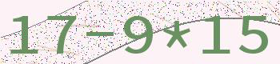
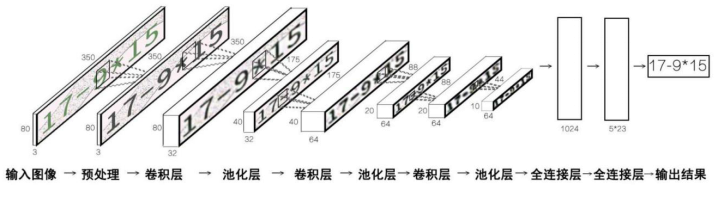
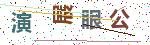
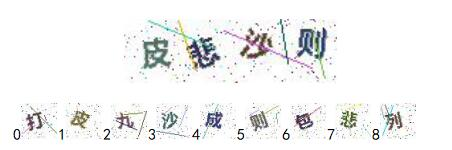

# 验证码识别CAPTCHA_recognizing
<b>第九届中国大学生服务外包创新创业大赛-A16验证码识别（河海大学-李说啥都对）</b> 
--------
本项目抛弃了传（过）统（时）的SVM支持向量机，使用卷积神经网络(Convolutional Neural Networks, CNN)针对所给验证码进行识别，五类验证码的准确率均在95%+，第一类竟达到100%。Let's come to the point!
  

第一类验证码 First CAPTCHA
----------

第一类验证码为四则运算验证码，包含一个四则运算，验证方法为要求用户输出运算表达式及结果。验证码包含噪点干扰。如图示例： 
  

卷积操作拓扑图如下： 
 

第二类验证码 Second CAPTCHA
----------

第二类验证码为英文字母+数字验证码，包含5个字符，验证方法为要求用户输出验证码中的字符，大小写不限。验证码包含噪点干扰，文字无旋转形变。如图示例： 
 

第三类验证码 Third CAPTCHA
----------

第三类验证码为英文字母+数字验证码，包含4个字符，验证方法为要求用户输出验证码中的字符。验证码包含噪点干扰，文字包含旋转形变。如图示例： 
 

第四类验证码 Fourth CAPTCHA
----------

第四类验证码为中文验证码，包含4个中文汉字，验证方法为要求用户选出4个汉字中被旋转90度的那一个。四个汉字从左到右序号为0，1，2，3，输出被旋转的汉字序号即可。如图示例： 
 

第五类验证码 Fifth CAPTCHA
----------

第五类验证码为中文验证码，包含4个中文汉字和9个中文单字，验证方法为要求用户从9个单字中按从左到右的顺序选出验证码中的汉字。验证码包含噪点干扰，文字包含旋转形变。如图示例： 
 

第五类我现在有两个思路： 

1.**暹罗网络(Siamese Network)**，主要是因为训练样本不够并且标签无实际意义； 
2.**使用条件生成式对抗网络(Conditional Generative Adversarial Networks, cGAN)**，可以解决训练样本不足和标签无意义问题。
决赛时问了几队用的都是Siamese，没有人（没听说）用cGAN的，立个flag，2018年内要把两种方法都试一下！！！
 
ps：因为样本数据太多就不传了
   
**技术交流**可以加我QQ：879251286 **加时请表明身份,否则一律拒绝**
